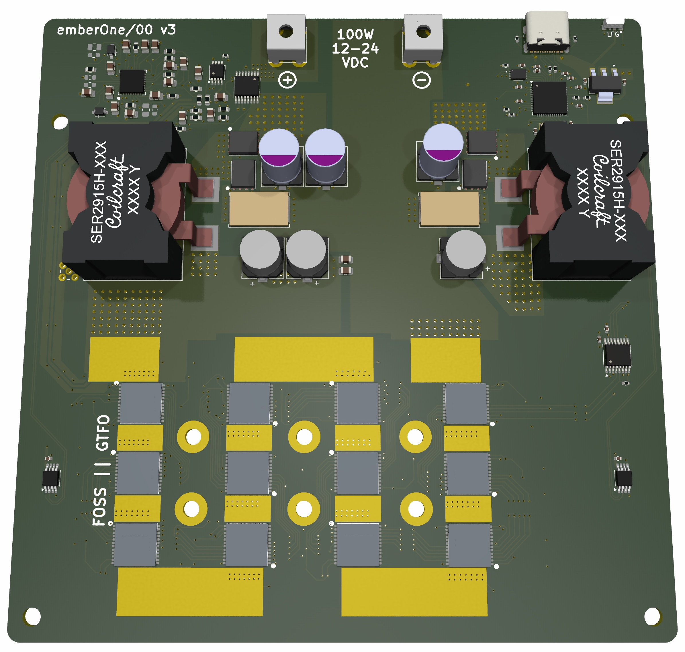

## Open Hashboard
The Ember One Standardized Features include:

* Power Consumption of ~100W
* Input voltage range 12-24vdc
* USB-C data communication
* on-board temperature sensors
* 125mm x 125mm form factor

 

Check the GitHub repo linked below for the latest release. Ember One 00 is built with the Bitmain BM1362 ASICs. The current roadmap for future Ember One versions includes designs for an Intel BZM2 ASIC version, an Auradine ASIC version, and a Proto Mining ASIC version.

## Resources
[Ember One 00 PCB Github Repo](https://github.com/256-Foundation/emberone00-pcb/tree/master)

[Ember One Serial USB Firmware](https://github.com/256-Foundation/emberone-usbserial-fw)

## Motivation
The Bitcoin mining industry has been dominated by Bitmain and their closed proprietary hardware and many Bitcoiners have accepted this despite the open nature of the protocol and the applications built on it. Up until the Bitaxe project, there were no open source options at all. Ember One takes what the Bitaxe started to the next level, bringing the total Wattage to ~100W. A small but important step in the direction of open-source options. Each six-month Ember One grant cycle will bring a new version that supports a different ASIC chip but all version will fit the same standardized form factor. Components for the Ember One have been chosen to give end users the most flexibility and ease of use. For example, the input voltage ranges from 12-24 vdc and the control board communicates via USB to the hashboards. Users will have the options of running one hashboard or several hashboards, they can choose which ASIC chips they want, and all the pieces will be interchangeable.

If this sounds like a grant you want to support, then send The 256 Foundaton a tax deductible donation [here](https://pay.zaprite.com/pl_ZRWeSGjRWG)! Or use The 256 Foundation [PayNym](https://paynym.rs/+appetizingadministration90)!

## Community Support
For help with Ember One, please use [The 256 Foundation public forum](https://t.me/the256foundation) on Telegram.

## Team Members:
Lead Engineer = [@skot9000](https://x.com/skot9000)

Project Manager = [@econoalchemist](https://x.com/econoalchemist)
